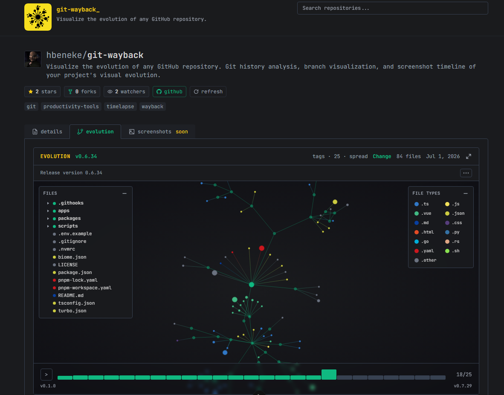

# git-wayback

[](https://www.gnu.org/licenses/gpl-3.0)
[](https://git-wayback.dev)
[](https://github.com/hbeneke/git-wayback)

A web application that renders the evolution of a GitHub repository as an animated file tree, built with Nuxt and D3.



**[Live Demo](https://git-wayback.dev)**

## About This Project

Give it an `owner/repo` and it reconstructs the repository's file structure at successive points in its history — tags or commits — and draws each one as a force-directed graph you can step through. Folders are parent nodes, files hang off them, colors come from the extension.

Comparable to [Gource](https://gource.io/), but served from a URL: no local clone, nothing to install, and the result is shareable.

### Features

- **Evolution diagram** — D3 force simulation of the file tree, with playback controls that step through snapshots or animate the whole sequence
- **Two history sources** — tags give meaningful intervals between releases; commits give finer resolution on repositories without releases, with a selectable branch
- **Sampling strategies** — `spread` distributes snapshots evenly across the available history, `latest` takes the most recent ones. Both cap at 30 snapshots
- **Repository overview** — languages, contributors, recent commits with expandable message bodies, and commit activity by hour and weekday
- **Rankings** — most visited repositories overall, this month and this week, aggregated from anonymous per-day visit counts

### How It Works

1. Tags or commits are listed from the GitHub REST API, up to a pool of 100
2. The pool is sampled down to the requested snapshot count **before** any tree is fetched, so a repository with thousands of refs still costs at most 30 tree requests
3. Each selected ref resolves to a commit SHA, and its recursive tree is fetched and reduced to path, name, size and extension
4. The resulting snapshot array is persisted and returned. The client builds the hierarchy and hands it to the D3 simulation

GitHub truncates the recursive tree endpoint for very large repositories. That flag is preserved per snapshot and surfaced in the UI rather than silently serving an incomplete file list.

## Tech Stack

- **[Nuxt 3](https://nuxt.com/)** - Vue 3 with SSR and Nitro server routes
- **[D3 v7](https://d3js.org/)** - Force simulation, zoom and custom rendering
- **[TypeScript](https://www.typescriptlang.org/)** - Type-safe development
- **[Tailwind CSS](https://tailwindcss.com/)** - Utility-first CSS framework
- **[Drizzle ORM](https://orm.drizzle.team/)** - PostgreSQL access, hosted on [Neon](https://neon.tech/)
- **[Upstash Redis](https://upstash.com/)** - Sliding-window rate limiting
- **[Turborepo](https://turbo.build/)** - Monorepo with pnpm workspaces
- **[Vitest](https://vitest.dev/)** - Fast unit testing framework
- **[Biome](https://biomejs.dev/)** - Fast linter and formatter
- **[Vercel](https://vercel.com/)** - Deployment and hosting platform

## Getting Started

### Prerequisites

- **Node.js** 20.x or higher
- **pnpm** 9.x
- A **PostgreSQL** database

### Installation & Development

1. Clone the repository:

   ```bash
   git clone https://github.com/hbeneke/git-wayback.git
   cd git-wayback
   ```

1. Install dependencies:

   ```bash
   pnpm install
   ```

   This will automatically install Git hooks for version management. See [Git Hooks](#git-hooks) section for details.

1. Create `apps/web/.env` with the variables listed below.

1. Start the development server:

   ```bash
   pnpm dev
   ```

   The site will be available at `http://localhost:3000`

### Environment Variables

| Variable | Required | Purpose |
| --- | --- | --- |
| `DATABASE_URL` | yes | PostgreSQL connection string |
| `GITHUB_TOKEN` | recommended | Raises the GitHub API budget from 60 to 5000 requests/hour |
| `UPSTASH_REDIS_REST_URL` | production | Rate limiter backend |
| `UPSTASH_REDIS_REST_TOKEN` | production | Rate limiter backend |

Without Upstash configured the application still runs in development. In production the GitHub-backed endpoints fail closed if the limiter is unreachable: an unavailable limiter is indistinguishable from one being drained deliberately.

Schema changes are applied with `pnpm db:push` from `packages/db`.

## Testing

Run unit tests:

```bash
pnpm test
```

## Code Quality

This project uses Biome for linting and formatting, and TypeScript for type checking:

```bash
pnpm lint
pnpm lint:fix
pnpm typecheck
```

## Git Hooks

The project includes automated Git hooks for version management:

### Available Hooks

- **pre-commit**: Automatically increments the patch version (e.g., 1.0.0 → 1.0.1) when committing non-markdown files
- **post-merge**: Automatically increments the minor version (e.g., 1.0.5 → 1.1.0) when merging `develop` into `master`

### Installation

Hooks are automatically installed when you run `pnpm install`. To manually install or reinstall:

```bash
pnpm hooks:install
```

To uninstall hooks:

```bash
pnpm hooks:uninstall
```

## Project Structure

```text
/
├── apps/
│   └── web/             # Nuxt application
│       ├── components/  # Vue components, including the D3 diagram
│       ├── composables/ # Shared client-side logic
│       ├── pages/       # Route pages
│       ├── server/      # Nitro API routes
│       └── tests/       # Vitest suites
├── packages/
│   ├── db/              # Drizzle schema and database client
│   └── shared/          # Constants, types and formatters shared by both sides
├── scripts/             # Hook installers and the master sync script
└── turbo.json           # Turborepo pipeline
```

Two tables back the application: `evolution_snapshots` caches computed snapshot sets, and `repo_visits` records one row per visitor, repository and day, which keeps the rankings bounded and the counts honest.

## Caching and API Budget

An uncached repository page costs six GitHub calls, which limits the deployment to roughly 830 views per hour on a single authenticated token. Two layers keep that under control.

**Repository overview** is cached for ten minutes with stale-while-revalidate, keyed on the repository alone so query parameters cannot fragment the entry.

**Evolution snapshots** are cached in PostgreSQL under a key covering every input that changes the result: repository, source, branch, sampling strategy and snapshot count. Freshness is decided by the repository's `pushed_at` timestamp rather than an expiry — when it matches the value recorded at capture time, no commits have landed and the cached set is still exact regardless of age. That comparison costs one request and only runs once the row is older than five minutes. If the timestamp is unavailable, a 24-hour TTL applies as a fallback.

A manual refresh bypasses both layers. It is restricted to the repository endpoints, accepted on GET only, and charged against two sliding windows before reaching a handler: five per hour per IP address and sixty per hour across all callers. Requests are ignored entirely when the cached row is less than a minute old.

## Contributing

Contributions are welcome! This project is open source under the GPL-3.0 license, which means you can use, modify, and distribute the code as long as you maintain the same license.

### How to Contribute

1. **Fork the repository**
2. **Create a feature branch** (`git checkout -b feature/amazing-feature`)
3. **Make your changes**
4. **Run tests, linting and type checking**:

   ```bash
   pnpm test
   pnpm lint
   pnpm typecheck
   ```

5. **Commit your changes** (`git commit -m 'Add some amazing feature'`)
6. **Push to the branch** (`git push origin feature/amazing-feature`)
7. **Open a Pull Request**

### Contribution Guidelines

- Follow the existing code style (enforced by Biome)
- Use [Conventional Commits](https://www.conventionalcommits.org/) for commit messages (e.g., `feat:`, `fix:`, `docs:`, `chore:`)
- Add tests for new features
- Update documentation as needed
- For large changes, consider opening an issue first to discuss

## License

This project is licensed under the **GNU General Public License v3.0** - see the [LICENSE](./LICENSE) file for details.

This means you are free to:

- ✅ Use this code for personal or commercial projects
- ✅ Modify and adapt the code
- ✅ Distribute your modifications

Under the conditions that:

- You must disclose the source code
- You must include the same GPL-3.0 license
- You must state significant changes made to the code

## Author

Enrique Quero (Habakuk Beneke) — [@hbeneke](https://github.com/hbeneke)

## Acknowledgments

- [Andrew Caudwell](https://github.com/acaudwell) for [Gource](https://gource.io/), the tool that inspired this project
- The Nuxt and D3 teams for the tools this runs on

---

If you find this project useful, consider giving it a star on GitHub!
